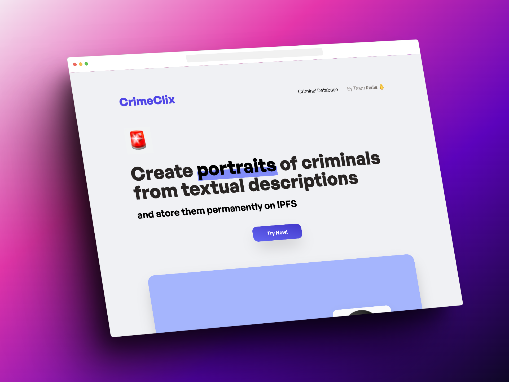
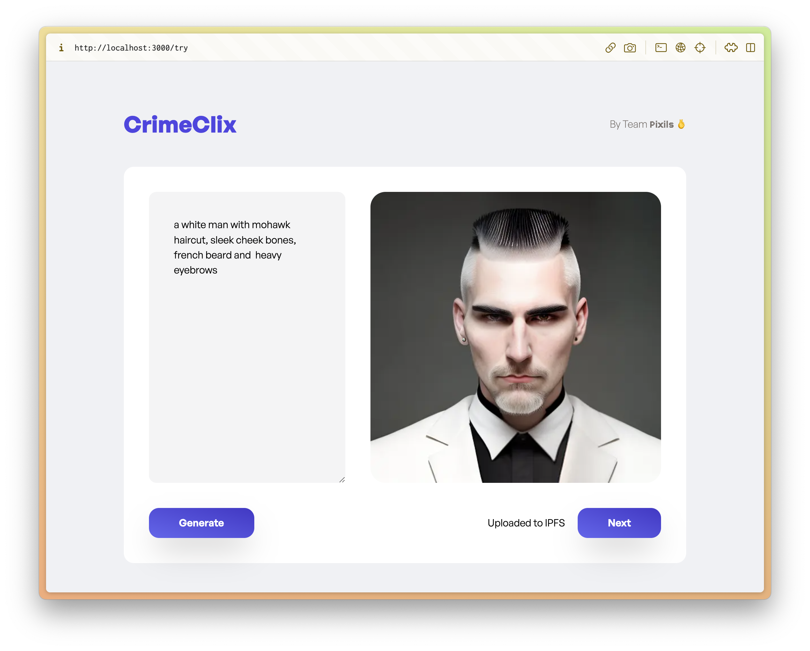

# CrimeClix

https://crime-clix.vercel.app/

Create realistic portraits of criminals from **textual description** or a **sketch** and save them to a **IPFS**.
Identify these criminals from live CCTV feeds in real time and raise alerts.




# Technologies
- **Frontend**: [Next.js](https://nextjs.org)
- **Backend**: [flask](https://flask.palletsprojects.com/)
- **Storage**: [web3.storage](https://web3.storage)
- **Deployment**: [Vercel](https://vercel.com)
- **ML Models**: [YOLOv4](https://arxiv.org/abs/2004.10934), [Single Shot Detection](https://arxiv.org/abs/1512.02325)

# Building

> **Warning**
> 
> If your are running this from Thapar's network you might need to use some VPN (like [Warp](https://1.1.1.1)) because IPFS's URLs are blocked on the network as they belong to the Peer to Peer file sharing category

clone the repository

```shell
https://github.com/Pixils/CrimeClix.git
cd CrimeClix
```

## Backend setup

Create account on [web3.storage](https://web3.storage) and get your API key from https://web3.storage/tokens/ and paste this key into `/backend/instance/config.py`

```shell
cd backend

# setup environment
python -m venv venv
pip install -r requirements.txt

# start flask server
flask --app crimeclix run --debug
```

## frontend setup

Create account on [Stable Diffusion API](https://stablediffusionapi.com) and get your API key from https://stablediffusionapi.com/settings/api

```shell
cd frontend
npm i
npm run dev
```
